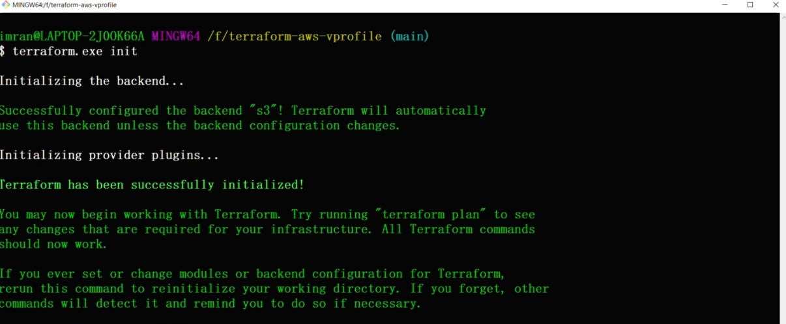
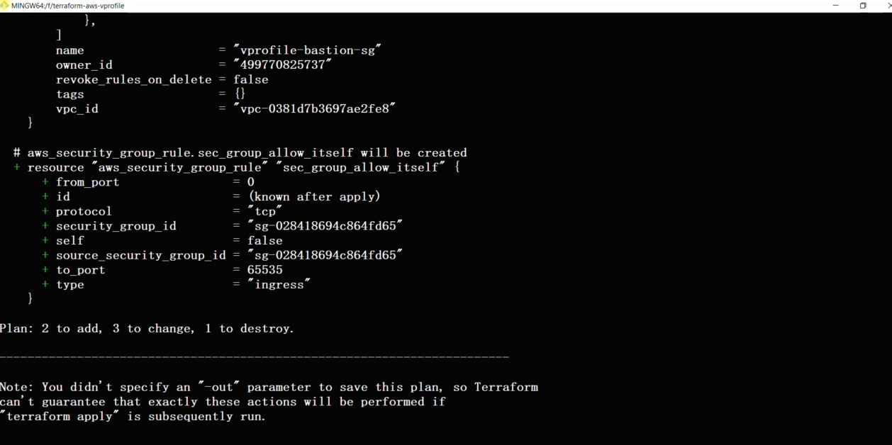
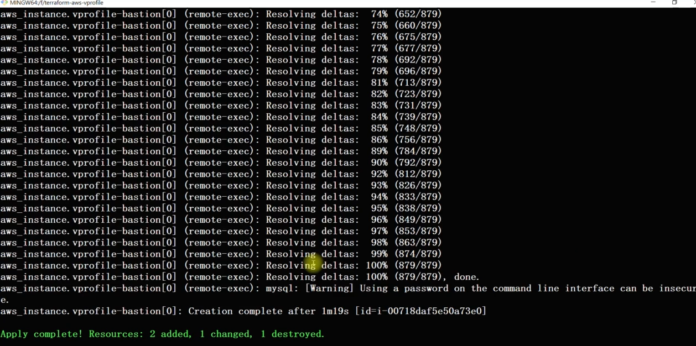
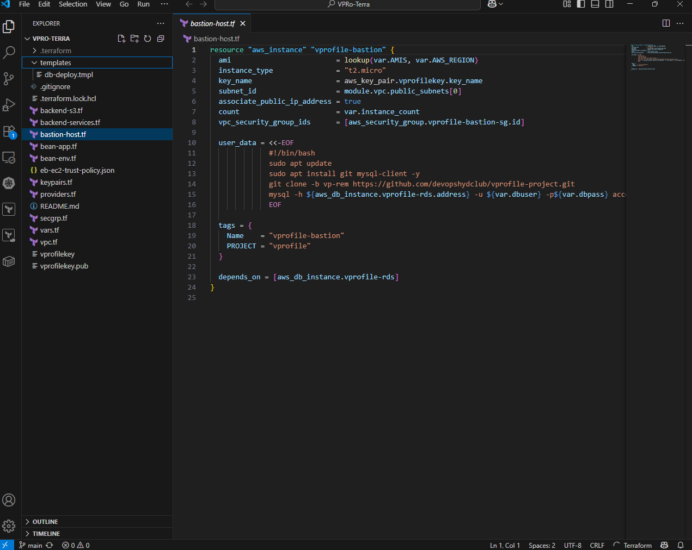
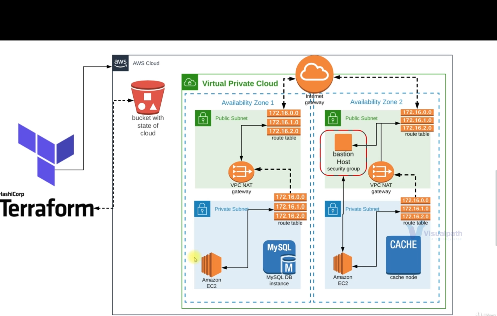

#  Terraform AWS Infrastructure with Remote State

This project demonstrates how to provision AWS infrastructure using **Terraform**, with a focus on **remote state management** via S3 and infrastructure modularization.

---

##  Technologies Used

- Terraform
- AWS EC2, VPC, Security Groups
- AWS S3 (Remote Backend)
- AWS IAM (for state access)
- Terraform Modules

---

## Screenshots

## ✅ Terraform Init

## ✅ Terraform Plan

## ✅ Terraform Apply

## ✅ Folder Structure

## ✅ Full Project Structure

---

## Learning Outcome

- Wrote Infrastructure as Code (IaC) using Terraform
- Created EC2, VPC, and S3 resources on AWS
- Managed Terraform remote state using S3 backend
- Practiced Terraform commands: `init`, `plan`, `apply`, `destroy`

